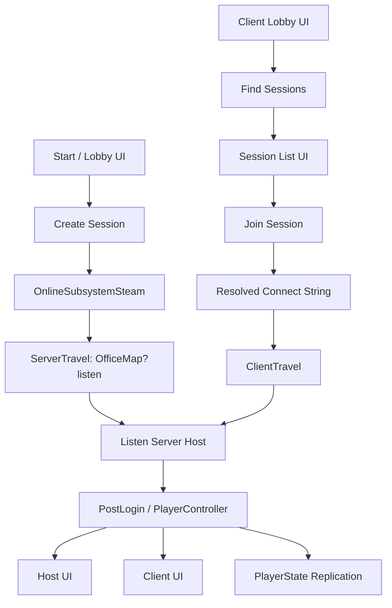

# UE_ReNe Listen Server Multiplayer Development Portfolio

## 한 줄 요약

**UE_ReNe 프로젝트에서 Listen Server 기반 멀티플레이의 세션 생성, 검색, 참가, 맵 이동, Host/Client UI 분기, PlayerState 동기화 흐름을 C++ 중심으로 구축했다.**

이 작업은 단순히 "멀티플레이가 켜지는 상태"가 아니라, 사용자가 로비에서 방을 만들고, 다른 사용자가 세션을 검색해 참가하며, 접속 이후 역할에 따라 서로 다른 UI와 데이터 흐름을 갖는 플레이 가능한 멀티플레이 구조를 목표로 했다.

---

## 본인 기여 확인

커밋 내역 기준으로 `Dove9` / `khb532` 계정이 본인 기여로 확인된다.

| Author | Email | Commit Count |
|---|---:|---:|
| `khb532` | `khb532@naver.com` | 84 |
| `Dove9` | `khb532@naver.com` | 35 |
| `Dove9` | `50840243+khb532@users.noreply.github.com` | 19 |

**총 138개 커밋에서 본인 계정의 개발 흔적이 확인된다.**

멀티플레이 관련 대표 커밋은 다음과 같다.

| Commit | Message | 의미 |
|---|---|---|
| `88f2d0d` | `[WIP] Multiplay` | 멀티플레이 기반 작업 시작 |
| `f60a920` | `[FEAT] Session Control` | 세션 생성, 검색, 참가 제어 구현 |
| `6417afd` | `[WIP] Session UI Binding` | 세션 UI와 코드 연결 |
| `9657053` | `[FEAT] Session UI Bind` | 세션 리스트, 참가 UI 바인딩 |
| `e38a47e` | `[FIX] session name sync` | 세션 이름 동기화 개선 |
| `62702b1` | `[FIX] Session List Clear` | 세션 검색 리스트 갱신 처리 |
| `b713a30` | `[FIX] DefaultEngine : steamsocket` | Steam 네트워크 설정 보정 |
| `0aec2f0` | `[FIX] Host/Client UI 분리` | Host와 Client 역할별 UI 분기 |
| `bd67634` | `[FIX] RPC` | RPC 흐름 수정 |
| `28f74ba` | `[FIX] Client RPC : ShowHUD` | Client UI 표시 RPC 보정 |

---

## 개발 목표

UE_ReNe는 기업 담당자와 구직자가 같은 3D 공간에 접속해 상호작용하는 구조를 가진다. 이 구조를 성립시키기 위해서는 다음 요구가 필요했다.

- **Host가 세션을 생성하고 Listen Server로 게임 월드를 열 수 있어야 한다.**
- **Client가 Steam 세션 목록을 검색하고 선택한 세션에 참가할 수 있어야 한다.**
- **접속 이후 Host와 Client가 서로 다른 역할과 UI를 가져야 한다.**
- **로그인/역할 데이터가 서버 권한 아래 PlayerState로 동기화되어야 한다.**
- **UI 표시, HUD 복귀, 면접 요청 같은 흐름은 RPC를 통해 각 클라이언트에 정확히 전달되어야 한다.**

내가 맡은 핵심은 이 요구를 Unreal의 `OnlineSubsystem`, `GameInstance`, `PlayerController`, `PlayerState`, `GameMode` 흐름으로 연결하는 것이었다.

---

## 전체 구조



이 구조에서 `URene_GameInstance`는 세션 생명주기를 담당하고, `URene_LobbyWidget`과 `URene_SessionInfoWidget`은 사용자가 세션을 만들고 참가하는 진입점을 제공한다. 접속 이후에는 `ARene_PlayerController`와 `ARene_PlayerState`가 역할별 UI와 데이터 동기화를 담당한다.

---

## 핵심 구현 1. Listen Server 세션 생성

세션 생성은 `URene_GameInstance`에서 처리했다. 현재 OnlineSubsystem이 `NULL`이면 LAN, Steam이면 Online 세션으로 동작하도록 분기했고, 세션 검색에 필요한 `GAMEID`, `ROOMNAME` 메타데이터를 함께 광고하도록 구성했다.

```cpp
void URene_GameInstance::CreateReneSession(int32 n_maxplayer, FString s_sessionname)
{
    FOnlineSessionSettings settings;
    FName sysname = Online::GetSubsystem(GetWorld())->GetSubsystemName();

    settings.bIsLANMatch = sysname.IsEqual(TEXT("NULL"));
    settings.NumPublicConnections = n_maxplayer;
    settings.bShouldAdvertise = true;
    settings.bAllowJoinInProgress = true;
    settings.bUseLobbiesIfAvailable = true;
    settings.bUsesPresence = true;
    settings.Set(FName(TEXT("GAMEID")), FString(TEXT("UE_ReNe")), EOnlineDataAdvertisementType::ViaOnlineServiceAndPing);
    settings.Set(FName(TEXT("ROOMNAME")), s_sessionname, EOnlineDataAdvertisementType::ViaOnlineServiceAndPing);

    if (p_ReneSessionInterface == nullptr) return;

    FUniqueNetIdPtr netid = GetWorld()
        ->GetFirstLocalPlayerFromController()
        ->GetUniqueNetIdForPlatformUser()
        .GetUniqueNetId();

    p_ReneSessionInterface->CreateSession(*netid, NAME_GameSession, settings);
}
```

**어필 포인트**

- Unreal의 Online Session API를 직접 사용해 세션 생성 로직을 C++로 구현했다.
- Steam 환경과 로컬 테스트 환경을 모두 고려해 `bIsLANMatch`를 동적으로 설정했다.
- 세션 이름을 `ROOMNAME`으로 광고해 UI에서 사용자가 식별 가능한 방 목록을 만들 수 있게 했다.

---

## 핵심 구현 2. 세션 생성 성공 후 Listen 맵 이동

세션 생성이 성공하면 Host는 `OfficeMap?listen`으로 이동한다. 이 부분이 UE_ReNe의 Listen Server 구조에서 가장 중요한 전환점이다.

```cpp
void URene_GameInstance::OnCreateReneSession(FName sessionname, bool b_success)
{
    FName sysname = Online::GetSubsystem(GetWorld())->GetSubsystemName();
    LOGWARNF(TEXT("Online Sub System : %s"), *sysname.ToString());

    if (b_success)
    {
        LOGWARNF(TEXT("%s Session Created"), *sessionname.ToString());
        GetWorld()->ServerTravel(TEXT("/Game/Maps/OfficeMap?listen"));
    }
    else
    {
        LOGWARNF(TEXT("%s Session Creation Failed"), *sessionname.ToString());
    }
}
```

**어필 포인트**

- 세션 생성과 월드 전환을 분리하지 않고 하나의 흐름으로 연결했다.
- `?listen` 옵션을 통해 Host가 서버 역할을 하면서 동시에 플레이어로 접속하는 구조를 만들었다.
- 별도 Dedicated Server 없이 팀 프로젝트 시연에 적합한 멀티플레이 환경을 구축했다.

---

## 핵심 구현 3. 세션 검색과 참가

Client는 세션 목록을 검색하고, 선택한 세션의 접속 주소를 얻어 `ClientTravel`로 접속한다.

```cpp
void URene_GameInstance::FindReneSession()
{
    p_ReneSessionSearch = MakeShared<FOnlineSessionSearch>();

    FName sysname = Online::GetSubsystem(GetWorld())->GetSubsystemName();

    p_ReneSessionSearch->bIsLanQuery = sysname.IsEqual(TEXT("NULL"));
    p_ReneSessionSearch->MaxSearchResults = 100;

    if (!sysname.IsEqual(TEXT("NULL")))
    {
        p_ReneSessionSearch->QuerySettings.Set(SEARCH_LOBBIES, true, EOnlineComparisonOp::Equals);
        p_ReneSessionSearch->QuerySettings.Set(FName(TEXT("GAMEID")), FString(TEXT("UE_ReNe")), EOnlineComparisonOp::Equals);
    }

    if (!p_ReneSessionInterface.IsValid()) return;

    p_ReneSessionInterface->FindSessions(0, p_ReneSessionSearch.ToSharedRef());
}
```

```cpp
void URene_GameInstance::OnJoinReneSession(FName session_name, EOnJoinSessionCompleteResult::Type result)
{
    if (result == EOnJoinSessionCompleteResult::Type::Success)
    {
        FString URL;

        if (p_ReneSessionInterface->GetResolvedConnectString(session_name, URL))
        {
            if (APlayerController* pc = GetWorld()->GetFirstPlayerController())
            {
                FInputModeGameOnly im;
                pc->SetInputMode(im);
                pc->SetShowMouseCursor(false);
                pc->ClientTravel(URL, TRAVEL_Absolute);
            }
        }
    }
}
```

**어필 포인트**

- 검색 조건에 `GAMEID`를 넣어 다른 Steam 세션과 UE_ReNe 세션을 구분했다.
- 세션 검색 결과와 실제 접속 흐름을 `GetResolvedConnectString`과 `ClientTravel`로 완성했다.
- 참가 직전 입력 모드를 GameOnly로 전환해 로비 UI 상태가 인게임 조작을 방해하지 않도록 처리했다.

---

## 핵심 구현 4. 로비 UI와 세션 시스템 바인딩

세션 시스템은 C++ 로직만으로 끝나지 않는다. 사용자가 실제로 방을 찾고 들어갈 수 있도록 UI 이벤트와 연결해야 한다.

```cpp
void URene_LobbyWidget::NativeConstruct()
{
    Super::NativeConstruct();

    URene_GameInstance* GI = Cast<URene_GameInstance>(GetGameInstance());
    GI->OnFindReneSessionComplete.AddUObject(this, &URene_LobbyWidget::OnFindComplete);

    btn_Find->OnClicked.AddDynamic(this, &URene_LobbyWidget::OnClickedFind);
    btn_Create->OnClicked.AddDynamic(this, &URene_LobbyWidget::OnClickedCreate);
    btn_CreateSession->OnClicked.AddDynamic(this, &URene_LobbyWidget::OnClickedCreateSession);
}
```

```cpp
void URene_LobbyWidget::OnFindComplete(int idx, FString str)
{
    URene_SessionInfoWidget* p_ui = CreateWidget<URene_SessionInfoWidget>(GetWorld(), session_info_widget);
    p_ui->SetSessionInfo(idx, str);
    scr_SessionList->AddChild(p_ui);
}
```

```cpp
void URene_SessionInfoWidget::OnClickedJoin()
{
    URene_GameInstance* GI = Cast<URene_GameInstance>(GetGameInstance());
    GI->JoinReneSession(info_idx);
}
```

**어필 포인트**

- 비동기 세션 검색 결과를 Delegate로 UI에 전달했다.
- 검색 결과마다 참가 버튼을 가진 위젯을 동적으로 생성했다.
- UI 레벨에서 세션 인덱스를 보관하고, 선택한 세션으로 정확히 Join하도록 연결했다.

---

## 핵심 구현 5. Host / Client 역할 분리

UE_ReNe에서 Host는 기업 담당자, Client는 구직자 역할에 가깝다. Listen Server에서는 Host도 로컬 플레이어이기 때문에 `HasAuthority()`와 `IsLocalController()`를 함께 고려해야 했다.

```cpp
void ARene_PlayerController::OnToggleMenu()
{
    if (HasAuthority())
    {
        OnCompanyUI();
    }
    else
    {
        OnSeekerUI();
    }
}
```

```cpp
void ARene_PlayerController::OnCompanyUI()
{
    if (!IsValid(companyui_class)) return;
    if (!HasAuthority() || !IsLocalPlayerController()) return;

    if (IsValid(company_ui))
    {
        company_ui->SetVisibility(ESlateVisibility::Visible);
        EnableUIControll();
    }
    else
    {
        company_ui = CreateWidget<URene_Company_Widget>(this, companyui_class);
        if (!IsValid(company_ui)) return;

        company_ui->AddToViewport();
        EnableUIControll();
    }
}
```

```cpp
void ARene_PlayerController::OnSeekerUI()
{
    if (!IsLocalPlayerController() || HasAuthority()) return;
    if (!IsValid(seekerui_class)) return;

    if (!IsValid(seeker_ui))
    {
        seeker_ui = CreateWidget<URene_Seeker_Widget>(this, seekerui_class);
        if (IsValid(seeker_ui))
        {
            seeker_ui->AddToViewport();
            EnableUIControll();
        }
    }
}
```

**어필 포인트**

- Listen Server 특성상 Host가 Server이면서 Local Client인 점을 고려해 UI 조건을 분리했다.
- Host에게만 기업 UI가 보이고, Client에게만 구직자 UI가 보이도록 역할 기반 화면 흐름을 만들었다.
- 멀티플레이에서 흔히 발생하는 "서버 권한 UI가 원격 클라이언트에 잘못 뜨는 문제"를 조건 분기로 제어했다.

---

## 핵심 구현 6. PlayerState 데이터 동기화

Client의 로그인 정보와 역할 정보는 서버 권한 아래 `PlayerState`로 전달되어야 한다. Host는 직접 반영하고, Client는 Server RPC를 통해 서버에 전달하도록 구성했다.

```cpp
if (HasAuthority())
{
    TObjectPtr<ARene_PlayerState> ps = GetPlayerState<ARene_PlayerState>();
    if (ps)
    {
        ps->SetReneUserData(data);
        ps->SetPlayerName(data.Name);
        LOGWARNF(TEXT("Host: PlayerState Set Directly - %s"), *data.Name);
    }
}
else
{
    ServerRPC_SendUserData(data);
    LOGWARNF(TEXT("Client: ServerRPC Called - %s"), *data.Name);
}
```

```cpp
void ARene_PlayerController::ServerRPC_SendUserData_Implementation(struct FReneUserData data)
{
    ARene_PlayerState* ps = GetPlayerState<ARene_PlayerState>();
    if (ps)
    {
        ps->SetReneUserData(data);
        ps->SetPlayerName(data.Name);
    }
}
```

`PlayerState`에서는 필요한 값을 Replication 대상으로 등록했다.

```cpp
void ARene_PlayerState::GetLifetimeReplicatedProps(TArray<class FLifetimeProperty>& OutLifetimeProps) const
{
    Super::GetLifetimeReplicatedProps(OutLifetimeProps);

    DOREPLIFETIME(ARene_PlayerState, userdata);
    DOREPLIFETIME(ARene_PlayerState, bVoicable);
    DOREPLIFETIME(ARene_PlayerState, InterviewResultID);
}
```

**어필 포인트**

- Client 데이터를 임의로 로컬에만 저장하지 않고, 서버 권한의 `PlayerState`로 전달했다.
- `PlayerState` 복제를 통해 다른 UI와 시스템이 공통된 플레이어 정보를 참조할 수 있게 했다.
- Host와 Client의 처리 경로를 분리해 Listen Server 환경에서도 데이터 흐름이 깨지지 않게 했다.

---

## 핵심 구현 7. Client RPC 기반 UI 복구

멀티플레이에서는 서버에서 호출한 UI 함수가 실제 Client 화면에 표시되지 않는 문제가 자주 발생한다. 이를 해결하기 위해 HUD 표시를 Server RPC와 Client RPC로 분리했다.

```cpp
UFUNCTION(Server, Reliable)
void ServerRPC_ShowHUD();

UFUNCTION(Client, Reliable)
void ClientRPC_ShowHUD();
```

```cpp
void ARene_PlayerController::ServerRPC_ShowHUD_Implementation()
{
    ClientRPC_ShowHUD();
}

void ARene_PlayerController::ClientRPC_ShowHUD_Implementation()
{
    ShowHUD();
}
```

**어필 포인트**

- 서버 명령과 클라이언트 화면 갱신을 분리해 UI 표시 책임을 명확히 했다.
- Listen Server와 Remote Client 양쪽에서 HUD 복귀 흐름이 동작하도록 RPC 경로를 보정했다.
- 실제 커밋 `28f74ba [FIX] Client RPC : ShowHUD`로 문제 해결 이력이 남아 있다.

---

## 사용 기술

- **Unreal Engine C++**
- **OnlineSubsystem**
- **OnlineSubsystemSteam**
- **Listen Server**
- **ServerTravel / ClientTravel**
- **Server RPC / Client RPC**
- **PlayerState Replication**
- **UMG Widget Binding**
- **GameInstance 기반 세션 생명주기 관리**

---

## 포트폴리오용 핵심 문장

아래 문장은 이 작업을 이력서나 포트폴리오 페이지에 짧게 요약할 때 사용할 수 있다.

> UE_ReNe 프로젝트에서 Unreal Engine C++ 기반의 Listen Server 멀티플레이 구조를 구현했습니다. OnlineSubsystemSteam을 이용해 세션 생성, 검색, 참가, Steam Lobby 광고, 세션 메타데이터 동기화를 처리했고, 세션 생성 성공 시 `OfficeMap?listen`으로 ServerTravel하여 Host가 서버 역할을 수행하도록 구성했습니다. 또한 Client 참가 시 Resolved Connect String 기반 `ClientTravel`을 연결하고, Host/Client 역할별 UI 분기와 PlayerState Replication, Server/Client RPC 기반 HUD 복구 흐름을 구현해 실제 시연 가능한 멀티플레이 진입 루프를 완성했습니다.

---

## 성과 정리

**내가 만든 것**

- Steam 기반 세션 생성/검색/참가 흐름
- Listen Server 맵 이동 구조
- 로비 UI와 세션 리스트 동적 바인딩
- Host/Client 역할별 UI 분리
- Client 유저 데이터 Server RPC 전달
- PlayerState 기반 플레이어 정보 복제
- Client RPC 기반 HUD 표시 복구

**프로젝트에 준 효과**

- 팀 프로젝트에서 별도 Dedicated Server 없이 멀티플레이 시연이 가능해졌다.
- Host와 Client가 같은 공간에 접속한 뒤 서로 다른 역할을 수행할 수 있게 되었다.
- 세션 검색 UI와 Join 흐름이 연결되어 사용자가 직접 방을 만들고 참가할 수 있게 되었다.
- 이후 음성 채팅, AI 면접, 결과 리포트 등 상위 기능을 얹을 수 있는 네트워크 기반이 마련되었다.

---

## 근거 파일

| 파일 | 내용 |
|---|---|
| `Source/UE_ReNe/Private/Global/Rene_GameInstance.cpp` | 세션 생성, 검색, 참가, ServerTravel, ClientTravel |
| `Source/UE_ReNe/Public/Global/Rene_GameInstance.h` | 세션 API와 Delegate 선언 |
| `Source/UE_ReNe/Private/Widget/Rene_LobbyWidget.cpp` | 로비 UI와 세션 검색 결과 바인딩 |
| `Source/UE_ReNe/Private/Widget/Rene_SessionInfoWidget.cpp` | 세션 리스트 항목의 Join 처리 |
| `Source/UE_ReNe/Private/Player/Rene_PlayerController.cpp` | Host/Client UI 분기, Server RPC, Client RPC |
| `Source/UE_ReNe/Private/Global/Rene_PlayerState.cpp` | PlayerState Replication |
| `Config/DefaultEngine.ini` | OnlineSubsystemSteam 및 NetDriver 설정 |
| `Source/UE_ReNe/UE_ReNe.Build.cs` | OnlineSubsystem, OnlineSubsystemSteam 모듈 의존성 |

---

## 최종 어필

이 작업의 강점은 Unreal 멀티플레이의 핵심 요소를 기능 단위로 따로 구현한 것이 아니라, **사용자가 실제로 방을 만들고, 다른 사용자가 참가하고, 접속 후 역할별 UI와 데이터가 동기화되는 하나의 플레이 흐름으로 연결했다는 점**이다.

특히 Listen Server 구조에서는 Host가 서버이면서 동시에 로컬 플레이어이기 때문에 단순한 `HasAuthority()` 체크만으로는 UI와 데이터 흐름이 꼬일 수 있다. 이 프로젝트에서는 `GameInstance`의 세션 생명주기, `PlayerController`의 RPC와 UI 책임, `PlayerState`의 복제 책임을 나누어 멀티플레이 진입 구조를 안정적으로 구성했다.

결과적으로 UE_ReNe의 멀티플레이 기반은 이후 팀원이 작업한 음성 채팅, 면접 플로우, AI 리포트 같은 상위 기능이 붙을 수 있는 네트워크 토대가 되었다.
