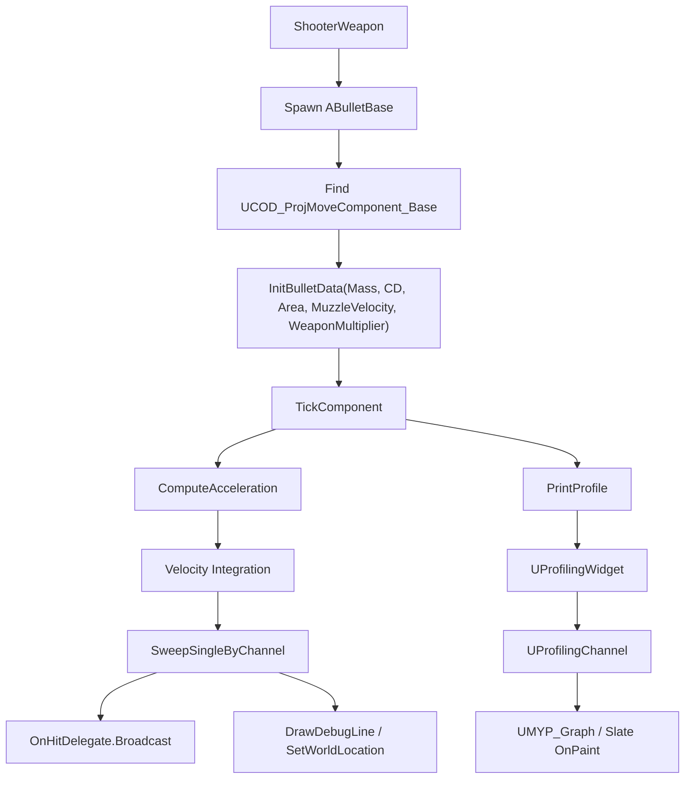

# COD 탄도 시뮬레이션 및 실시간 프로파일링 HUD 개발 보고서

작성일: 2026-05-27  
작성 목적: 포트폴리오/PPT 제작을 위한 개발 내용 정리  
원본 프로젝트: `E:\Workspace\Team\COD_CloneProject`  
포트폴리오 작업공간: `E:\Workspace\Unreal\MYP`  
분석 대상: `Source/MYP/cod`, `Source/MYP/Misc`, 관련 테스트/문서/커밋 이력

---

## 1. 문서 요약

이번 작업은 원본 COD 클론 프로젝트의 탄환/무기 구현을 개인 작업공간으로 가져온 뒤, 포트폴리오에 보여줄 수 있도록 탄도 시뮬레이션 구조와 디버깅 도구를 확장한 작업이다.

원본 프로젝트에는 기본 FPS 템플릿 계열의 `ACODProjectile`, 아군 AI용 `ABulletActor`, `AWeaponBase`가 존재했다. 이 구현은 실제 게임 기능 구현에는 충분했지만, 포트폴리오 관점에서는 다음 한계가 있었다.

- 발사체별 물리 파라미터가 공통 구조로 정리되어 있지 않았다.
- 총탄과 로켓형 발사체를 같은 구조에서 확장하기 어려웠다.
- 탄도 튜닝 결과를 수치와 그래프로 확인하기 어려웠다.
- 디버그 라인은 있었지만, 속도 변화나 튜닝 결과를 누적해서 보여주는 UI가 없었다.

현재 작업공간에서는 이를 다음 방향으로 개선했다.

- `ABulletBase`로 발사체 공통 데이터와 히트 이벤트 흐름을 분리했다.
- `UCOD_ProjMoveComponent_Base`를 중심으로 커스텀 이동/충돌/적분 로직을 만들었다.
- `UCOD_ProjMoveComponent_Rifle`, `UCOD_ProjMoveComponent_Javelin`으로 탄종별 물리 모델을 확장했다.
- `UProfilingWidget`, `UProfilingChannel`, `UMYP_Graph`로 실시간 수치 출력과 Slate 그래프를 구현했다.
- `DistanceSign`과 테스트 맵을 통해 거리 기반 탄도 테스트 환경을 구성했다.

포트폴리오 제목으로는 다음이 적합하다.

> Unreal Engine C++ 기반 탄도 시뮬레이션 및 실시간 프로파일링 HUD 구현

---

## 2. 참고한 기존 자료

### 원본 프로젝트 코드

- `E:\Workspace\Team\COD_CloneProject\Source\COD\CODProjectile.h`
- `E:\Workspace\Team\COD_CloneProject\Source\COD\CODProjectile.cpp`
- `E:\Workspace\Team\COD_CloneProject\Source\COD\CODWeaponComponent.h`
- `E:\Workspace\Team\COD_CloneProject\Source\COD\CODWeaponComponent.cpp`
- `E:\Workspace\Team\COD_CloneProject\Source\COD\Public\Ally\BulletActor.h`
- `E:\Workspace\Team\COD_CloneProject\Source\COD\Private\Ally\BulletActor.cpp`
- `E:\Workspace\Team\COD_CloneProject\Source\COD\Public\Ally\WeaponBase.h`
- `E:\Workspace\Team\COD_CloneProject\Source\COD\Private\Ally\WeaponBase.cpp`

### 현재 작업공간 코드

- `Source/MYP/cod/BulletBase.h`
- `Source/MYP/cod/BulletBase.cpp`
- `Source/MYP/cod/COD_ProjMoveComponent_Base.h`
- `Source/MYP/cod/COD_ProjMoveComponent_Base.cpp`
- `Source/MYP/cod/COD_ProjMoveComponent_Rifle.h`
- `Source/MYP/cod/COD_ProjMoveComponent_Rifle.cpp`
- `Source/MYP/cod/COD_ProjMoveComponent_Javelin.h`
- `Source/MYP/cod/COD_ProjMoveComponent_Javelin.cpp`
- `Source/MYP/cod/SmallCaliber.h`
- `Source/MYP/cod/SmallCaliber.cpp`
- `Source/MYP/cod/Javelin.h`
- `Source/MYP/cod/Javelin.cpp`
- `Source/MYP/cod/DistanceSign.h`
- `Source/MYP/cod/DistanceSign.cpp`
- `Source/MYP/Misc/MYP_Graph.h`
- `Source/MYP/Misc/MYP_Graph.cpp`
- `Source/MYP/Misc/ProfilingChannel.h`
- `Source/MYP/Misc/ProfilingChannel.cpp`
- `Source/MYP/Misc/ProfilingWidget.h`
- `Source/MYP/Misc/ProfilingWidget.cpp`
- `Source/MYP/MYP_TestGameMode.h`
- `Source/MYP/MYP_TestGameMode.cpp`
- `Source/MYP/TP_FirstPerson/Variant_Shooter/Weapons/ShooterWeapon.h`
- `Source/MYP/TP_FirstPerson/Variant_Shooter/Weapons/ShooterWeapon.cpp`

### 기존 개발문서

- `Document/COD/TestEnv_Setup.md`
- `Document/Reports/COD_CloneProject/Daily_Report_2026-03-06.md`
- `Document/UE_UIwork_Guide.md`
- `Document/UE_Delegate_Guide.md`
- `Document/UE_ObjectPointer_Guide.md`

### 관련 커밋 흐름

```text
2026-03-06 c8d20ca Test환경 구축중
2026-03-08 7ca5c82 [DOCS] TestEnv_Setup - DistanceSign 구현 완료 및 스타팅 라인 배치 기록
2026-03-31 640b3aa [FEAT] ShooterProjectile <-> COD_ProjectileMovementComponent 연동 완료
2026-04-02 65d7919 [FIX] 디버그라인 추가
2026-04-02 6299ac4 [FIX] Projectile Rotation Sync
2026-04-11 af45471 [WIP] 탄도 시뮬레이션 베이스 클래스 구축
2026-04-11 0b149cc [WIP] 라이플탄 탄도 시뮬레이션 구현 및 테스트 완료
2026-04-16 8a3fa18 [WIP] Profiling Widget
2026-04-16 555ddf4 [FEAT] 프로파일링 그래프 위젯 구현
2026-04-17 474d0f6 [FIX] BulletBase 지면 이탈 감지 및 탄도 수치 보정
2026-04-19 4eed32d [FEAT] Javelin 로켓 추진 발사체 구현
2026-04-19 1730885 [FEAT] Javelin 소프트런치 및 피치 토크 구현
2026-04-22 c2fe7e9 [FIX] 짐벌락 : 쿼터니언 회전으로 변경
```

---

## 3. 원본 프로젝트의 구현 상태

### 3.1 기본 FPS 발사체

원본 프로젝트의 `ACODProjectile`은 `UProjectileMovementComponent`를 사용한다.

주요 특징:

- `USphereComponent`를 루트 충돌체로 사용
- `UProjectileMovementComponent` 기반 이동
- `InitialSpeed = 3000.f`, `MaxSpeed = 3000.f`
- `bRotationFollowsVelocity = true`
- `bShouldBounce = true`
- `InitialLifeSpan = 3.0f`
- 물리 시뮬레이션 중인 컴포넌트에 맞았을 때만 impulse를 주고 파괴

포트폴리오 관점의 한계:

- 엔진 기본 컴포넌트 사용 비중이 크므로 직접 구현한 물리/수치 모델을 설명하기 어렵다.
- 질량, 항력계수, 단면적, 총구속도 같은 탄도 파라미터가 데이터로 정리되어 있지 않다.
- 총탄/로켓/유도탄처럼 서로 다른 탄종 확장 구조를 보여주기 어렵다.

### 3.2 아군 AI용 탄환

원본 프로젝트의 `ABulletActor`는 직접 Tick 기반 이동을 수행한다.

주요 특징:

- `Velocity = GetActorForwardVector() * BulletSpeed`
- 중력: `FVector(0.f, 0.f, GetWorld()->GetGravityZ())`
- 공기저항: `Accel += -Velocity * 0.8f`
- 위치 갱신: `SetActorLocation(NextPos)`
- 회전 갱신: `UKismetMathLibrary::MakeRotFromZX(Velocity, GetActorUpVector())`
- `DrawDebugLine`으로 궤적 시각화
- `lifetime > 3.f`일 때 파괴

포트폴리오 관점의 장점:

- Tick 기반 탄도 적분을 직접 구현했다는 점은 설명 가치가 있다.
- 중력과 항력을 반영한 단순 물리 모델이 존재한다.

포트폴리오 관점의 한계:

- 항력이 `-Velocity * 0.8f` 형태의 선형 감쇠라 실제 탄도 파라미터와 연결하기 어렵다.
- 충돌 Sweep 없이 `SetActorLocation` 중심으로 움직이므로 고속 탄환에서 터널링 문제가 생길 수 있다.
- 디버그 라인은 궤적을 보여주지만, 속도/가속도/튜닝값 변화를 수치로 추적하기 어렵다.
- 발사체 공통 베이스와 탄종별 파생 구조가 없다.

### 3.3 원본 무기 발사 흐름

원본 `AWeaponBase`는 다음 흐름을 가진다.

```text
PullTrigger()
  -> SpawnBullet()
  -> PlayMuzzleVFX()
  -> PlaySound2D()
```

이 구조는 게임플레이 기능으로는 명확하지만, 포트폴리오 작업에서는 발사체 자체의 물리/디버깅 확장을 더 강조할 필요가 있었다.

---

## 4. 현재 작업공간의 개선 방향

현재 작업공간의 핵심 방향은 다음과 같다.

```text
원본 단순 탄환/발사체
  -> 테스트 맵과 거리 표지판 구성
  -> First Person Shooter 무기 흐름과 연동
  -> BulletBase 기반 발사체 공통화
  -> 커스텀 이동 컴포넌트로 물리 계산 분리
  -> Rifle/Javelin 파생 컴포넌트로 탄종 확장
  -> UMG/Slate 프로파일링 HUD로 실시간 튜닝 지원
```

작업의 포트폴리오 메시지는 다음 한 문장으로 정리할 수 있다.

> 기존 COD 클론 프로젝트의 단순 탄환 구현을 기반으로, 탄종별 확장이 가능한 C++ 발사체 구조와 실시간 프로파일링 HUD를 설계해 탄도 튜닝 과정을 시각화했다.

---

## 5. 시스템 구조

### 5.1 전체 흐름



### 5.2 클래스 책임

| 클래스 | 역할 | 포트폴리오 포인트 |
|---|---|---|
| `ABulletBase` | 발사체 공통 데이터와 히트 후 처리 | 데이터 중심 발사체 베이스 |
| `UCOD_ProjMoveComponent_Base` | 이동, 적분, 충돌 Sweep, 프로파일 출력 | 엔진 기본 이동 컴포넌트 대체 |
| `UCOD_ProjMoveComponent_Rifle` | 총탄용 중력/항력 계산 | 물리 파라미터 기반 탄도 모델 |
| `UCOD_ProjMoveComponent_Javelin` | 로켓 추진, 연소 시간, 피치 변화 | 탄종별 확장 구조 |
| `ASmallCaliber` | 소구경 탄환 데이터 프리셋 | 고속 총탄 예시 |
| `AJavelin` | 재블린 데이터 프리셋 | 로켓형 발사체 예시 |
| `ADistanceSign` | 거리 표지판 | 탄착점/낙하량 테스트 환경 |
| `UProfilingWidget` | 채널 관리와 값 출력 | 디버깅 UI 진입점 |
| `UProfilingChannel` | 개별 값/그래프 표시 | 채널 단위 수치 관찰 |
| `UMYP_Graph` / `SMyGraphWidget` | Slate 기반 라인 그래프 | 직접 렌더링한 커스텀 위젯 |

---

## 6. 핵심 구현 내용

### 6.1 발사체 공통 베이스

`ABulletBase`는 탄도 파라미터와 히트 이벤트를 공통화한다.

주요 데이터:

- `Mass`
- `CD`
- `MuzzleVelocity`
- `CrossSectionArea`
- `DestructionDelay`
- `bHit`

주요 흐름:

```text
BeginPlay()
  -> FindComponentByClass<UCOD_ProjMoveComponent_Base>()
  -> OnHitDelegate.AddDynamic(...)

OnMovementHit()
  -> 중복 히트 방지
  -> OnBulletHit()

OnBulletHit()
  -> Blueprint 이벤트 호출
  -> DestructionDelay 후 Destroy 예약
```

포트폴리오 설명 포인트:

- 발사체 공통 데이터와 이동 로직을 분리했다.
- C++에서 공통 흐름을 만들고, Blueprint에서는 히트 연출/효과를 확장할 수 있게 했다.
- `DECLARE_DYNAMIC_MULTICAST_DELEGATE` 기반 이벤트 흐름을 사용해 이동 컴포넌트와 액터를 느슨하게 연결했다.

### 6.2 커스텀 투사체 이동 컴포넌트

`UCOD_ProjMoveComponent_Base`는 발사체 이동의 중심이다.

주요 처리:

- `UpdatedComponent = Owner->GetRootComponent()`
- `Velocity += ComputeAcceleration(DeltaTime) * DeltaTime`
- `NewPos = CurrentLocation + Velocity * DeltaTime`
- `SweepSingleByChannel`로 이동 구간 충돌 검사
- 충돌 시 `OnHitDelegate.Broadcast(HitResult)`
- 비충돌 시 위치 갱신 및 회전 동기화
- 프로파일링 위젯에 속도 출력

포트폴리오 설명 포인트:

- `UProjectileMovementComponent`를 그대로 쓰는 대신 직접 이동 컴포넌트를 구현했다.
- 고속 발사체의 프레임 간 이동을 고려해 단순 위치 이동이 아니라 Sweep 기반 충돌 검사를 넣었다.
- 이동 컴포넌트가 직접 UI 프로파일링에 값을 전달해 튜닝 피드백을 만들었다.

### 6.3 라이플탄 탄도 모델

`UCOD_ProjMoveComponent_Rifle`은 총탄형 발사체의 가속도를 계산한다.

계산 모델:

```text
GravityAccel = GravityScale * FVector(0, 0, -980)
DragForceMag = 0.5 * AirDensity * Cd * CrossSectionArea * Speed^2
DragAccelMag = DragForceMag / Mass * DragScale
DragAccel = -Velocity.Normalized * DragAccelMag
```

포트폴리오 설명 포인트:

- 원본 `ABulletActor`의 선형 감쇠를 `공기밀도 * 항력계수 * 단면적 * 속도 제곱` 기반 모델로 확장했다.
- `GravityScale`, `DragScale`을 노출해 실제성보다 게임플레이 튜닝을 우선할 수 있게 했다.
- `ASmallCaliber`에서 5.56mm급 탄환 프리셋을 구성했다.

주의:

- 현재 단위계는 UE의 cm 기반 좌표와 g/cm 단위 주석이 섞여 있다.
- 포트폴리오 발표에서는 “정밀 물리 재현”보다 “게임플레이 튜닝 가능한 탄도 모델”로 표현하는 편이 안전하다.

### 6.4 재블린 로켓 추진 모델

`UCOD_ProjMoveComponent_Javelin`은 일반 총탄과 다른 로켓형 발사체를 표현한다.

주요 데이터:

- `BurnTime`
- `ThrustAccel`
- `BurnElapsed`
- `AngularAccel`
- `AngularVelocity`
- `CurrentPitch`

주요 흐름:

```text
TickComponent()
  -> MainEngineBoost(DeltaTime)
  -> BurnElapsed >= 0이면 ApplyPitchTorque(80, DeltaTime)
  -> Super::TickComponent(...)
```

포트폴리오 설명 포인트:

- 같은 `ABulletBase` 계열 안에서 총탄과 로켓을 분리 구현했다.
- `BurnElapsed = -1.f`로 시작해 일정 시간 후 추진/피치 변화가 들어가는 소프트런치 형태를 표현했다.
- 로켓형 발사체는 현재 Forward 방향으로 추력을 더해 단순 포물선 탄도와 다른 비행을 만든다.

### 6.5 회전 동기화와 쿼터니언 보정

커밋 이력상 `c2fe7e9 [FIX] 짐벌락 : 쿼터니언 회전으로 변경`이 존재한다. 현재 `UCOD_ProjMoveComponent_Base::SyncRotation`은 `FQuat`을 반환하며, `FRotationMatrix::MakeFromXZ` 기반으로 속도 방향 회전을 만든다.

문서화 포인트:

- 초기 구현에서는 속도 방향을 `FRotator`/행렬 조합으로 맞추는 과정에서 특정 방향에서 회전 불안정성이 발생할 수 있었다.
- 이후 쿼터니언 기반 회전으로 바꿔 짐벌락 가능성을 줄였다.
- 이는 “구현 후 테스트에서 회전 문제를 발견하고 수학적 표현을 교체한 사례”로 발표하기 좋다.

### 6.6 실시간 프로파일링 HUD

`Misc` 폴더의 작업은 단순 UI가 아니라 탄도 튜닝을 위한 검증 도구다.

구조:

```text
UCOD_ProjMoveComponent_Base
  -> PrintProfile(ProfilingWidget, Velocity.Size() / 100.f, Name, Owner)
  -> UProfilingWidget::PrintValue()
  -> UProfilingChannel::SetValue()
  -> UMYP_Graph::AddSample()
  -> SMyGraphWidget::OnPaint()
```

주요 구현:

- `UProfilingWidget`
  - 이름별 채널 생성
  - 최대 채널 수 제한
  - `TWeakObjectPtr<AActor>`로 Owner 생존 상태 추적
  - Owner가 사라지면 채널 제거

- `UProfilingChannel`
  - 채널 이름과 현재 값을 표시
  - 런타임에 `UMYP_Graph`를 생성해 VerticalBox에 추가

- `UMYP_Graph` / `SMyGraphWidget`
  - UMG에서 사용할 수 있는 `UWidget` 래퍼
  - 실제 선 그래프는 Slate의 `SLeafWidget::OnPaint`에서 `FSlateDrawElement::MakeLines`로 렌더링
  - 값 히스토리를 화면 크기에 맞춰 좌표화

포트폴리오 설명 포인트:

- 기능 구현에서 끝나지 않고, 튜닝 결과를 확인할 수 있는 디버깅 도구까지 만들었다.
- UMG와 Slate의 역할을 나누어 사용했다.
- 기존 `Document/UE_UIwork_Guide.md`의 “C++는 구조, Blueprint는 표현” 원칙과 연결해 설명할 수 있다.

### 6.7 테스트 환경 구성

`ADistanceSign`은 탄착 지점과 거리 감각을 확인하기 위한 테스트용 액터다.

주요 구현:

- 루트, 메시, TextRender를 분리
- X 좌표를 Unreal 단위 기준으로 m 단위 변환
- `FNumberFormattingOptions`로 소수점 1자리 표시
- 테스트 맵에 거리 표지판과 스타팅 라인 배치

포트폴리오 설명 포인트:

- 탄도 구현은 수치만으로 끝나지 않고, 레벨 위에서 거리별 낙하량을 확인해야 한다.
- 이를 위해 테스트 전용 맵과 거리 표지판을 구성했다.

---

## 7. 문제 발생 - 원인 분석 - 해결

이 섹션은 포트폴리오 발표에서 가장 중요하다. 단순 기능 나열보다 “문제를 어떻게 발견했고 어떤 판단으로 고쳤는가”를 보여준다.

### 사례 1. 원본 탄환 구현이 포트폴리오용 탄도 시스템으로 확장하기 어려웠다

문제 발생:

- 원본 `ACODProjectile`은 `UProjectileMovementComponent` 중심의 기본 발사체였다.
- 원본 `ABulletActor`는 직접 적분을 했지만, 하나의 액터 안에 이동/회전/수명/디버그가 섞여 있었다.
- 총탄, 로켓, 추후 유도탄 같은 발사체를 같은 구조에서 확장하기 어려웠다.

원인 분석:

- 발사체 데이터와 이동 모델이 분리되어 있지 않았다.
- 물리 파라미터가 공통 API로 초기화되지 않았다.
- 엔진 기본 컴포넌트 기반 발사체와 직접 Tick 이동 발사체가 서로 다른 구조로 존재했다.

해결:

- `ABulletBase`를 만들고 `Mass`, `CD`, `MuzzleVelocity`, `CrossSectionArea`를 공통 데이터로 이동했다.
- `UCOD_ProjMoveComponent_Base`를 별도 컴포넌트로 만들어 이동/충돌/회전 책임을 분리했다.
- `InitBulletData()`를 통해 무기에서 발사체 데이터를 이동 컴포넌트로 전달했다.
- `Rifle`, `Javelin` 이동 컴포넌트가 `ComputeAcceleration()`만 다르게 구현하도록 구조화했다.

결과:

- 발사체 액터는 데이터와 히트 흐름을 담당하고, 이동 컴포넌트는 물리 계산을 담당하게 되었다.
- 총탄과 재블린을 같은 베이스 구조에서 확장할 수 있게 되었다.

포트폴리오 문장:

> 원본 프로젝트의 단일 탄환 구현을 발사체 데이터와 이동 컴포넌트로 분리해, 총탄과 로켓형 발사체를 같은 구조에서 확장할 수 있도록 리팩터링했습니다.

### 사례 2. 단순 선형 드래그로는 탄도 튜닝 근거를 설명하기 어려웠다

문제 발생:

- 원본 `ABulletActor`는 `Accel += -Velocity * 0.8f`로 항력을 단순 감쇠 처리했다.
- 값은 튜닝하기 쉽지만, 질량/항력계수/단면적 같은 탄도 파라미터와 연결되지 않았다.

원인 분석:

- 원본 구현은 게임플레이 프로토타입에 가까웠고, 포트폴리오에서 “탄도 모델”로 설명할 수 있는 수식 구조가 약했다.
- 탄환별 차이를 데이터로 표현하는 구조가 없었다.

해결:

- 라이플탄 이동 컴포넌트에서 속도 제곱 기반 항력 모델을 적용했다.
- `AirDensity`, `Cd`, `CrossSectionArea`, `Mass`, `DragScale`, `GravityScale`을 분리했다.
- `ASmallCaliber`에서 소구경 탄환용 기본값을 설정했다.

결과:

- 총탄별 파라미터 차이를 데이터로 보여줄 수 있게 되었다.
- 실제 물리와 게임플레이 튜닝 사이의 균형을 설명할 수 있게 되었다.

포트폴리오 문장:

> 원본의 선형 감쇠 탄도에서 확장해, 공기밀도, 항력계수, 단면적, 속도 제곱을 사용하는 항력 모델을 구현하고 게임플레이 튜닝 스케일을 별도로 제공했습니다.

### 사례 3. 탄도 튜닝 결과를 눈으로만 확인해야 했다

문제 발생:

- `DrawDebugLine`은 궤적을 볼 수 있지만, 속도 변화나 시간별 수치 변화를 확인하기 어렵다.
- 총알 속도와 로켓 추진 변화는 화면상 위치만으로는 튜닝 근거를 남기기 어렵다.

원인 분석:

- 기존 디버깅은 “선으로 보이는 궤적”에 머물렀다.
- 런타임 값을 채널별로 누적하고 표시하는 UI가 없었다.
- 탄종이 늘어날수록 여러 발사체의 수치를 동시에 관찰하기 어렵다.

해결:

- `UProfilingWidget`을 만들어 이름별 채널을 관리했다.
- `UProfilingChannel`에서 현재 값을 텍스트로 표시했다.
- `UMYP_Graph`와 `SMyGraphWidget`을 만들어 Slate 기반 라인 그래프를 렌더링했다.
- 이동 컴포넌트 Tick에서 `Velocity.Size() / 100.f` 값을 m/s 단위로 출력했다.

결과:

- 탄도 튜닝을 화면상의 위치와 수치 그래프로 함께 확인할 수 있게 되었다.
- 포트폴리오에서 “기능 구현 + 검증 도구 제작”을 함께 보여줄 수 있게 되었다.

포트폴리오 문장:

> 탄도 튜닝을 감으로만 하지 않도록, 이동 컴포넌트에서 실시간 속도를 수집하고 UMG/Slate 기반 HUD에 채널별 그래프로 표시하는 프로파일링 도구를 구현했습니다.

### 사례 4. 속도 방향 회전에서 짐벌락 문제가 발생했다

문제 발생:

- 발사체 회전을 속도 방향에 맞추는 과정에서 특정 각도에서 회전이 불안정해질 수 있었다.
- 커밋 이력에 `[FIX] 짐벌락 : 쿼터니언 회전으로 변경`이 남아 있다.

원인 분석:

- `FRotator` 중심 회전은 특정 축 조합에서 표현이 불안정해질 수 있다.
- 탄환처럼 속도 방향이 빠르게 변하는 물체는 회전 표현의 안정성이 중요하다.

해결:

- `SyncRotation()` 반환 타입을 `FQuat`으로 변경했다.
- `FRotationMatrix::MakeFromXZ(Forward, FVector::UpVector).ToQuat()`로 속도 방향 회전을 계산했다.
- 속도가 거의 0일 때는 현재 회전 또는 `FQuat::Identity`를 반환하도록 방어했다.

결과:

- 속도 방향 회전의 수학적 안정성을 높였다.
- 문제를 발견한 뒤 회전 표현 자체를 바꾼 개선 사례로 정리할 수 있다.

포트폴리오 문장:

> 발사체 회전 동기화 중 짐벌락 가능성을 확인하고, `FRotator` 기반 처리에서 `FQuat` 기반 처리로 변경해 회전 안정성을 개선했습니다.

### 사례 5. 일반 총탄 구조만으로는 로켓형 발사체를 표현하기 어려웠다

문제 발생:

- 라이플탄은 초기 속도와 항력/중력 중심의 포물선 운동에 가깝다.
- 재블린은 발사 후 일정 시간 뒤 추진이 들어가고, 피치가 상승하는 다른 비행 패턴이 필요하다.

원인 분석:

- 원본 탄환 구조는 로켓 연소 시간, 추력, 피치 토크 같은 상태를 표현하지 않았다.
- 총탄과 로켓을 별도 액터로만 만들면 중복 코드가 늘어날 가능성이 있다.

해결:

- `UCOD_ProjMoveComponent_Javelin`을 `UCOD_ProjMoveComponent_Base`에서 파생했다.
- `BurnTime`, `ThrustAccel`, `BurnElapsed`로 추진 구간을 표현했다.
- `AngularAccel`, `AngularVelocity`, `CurrentPitch`로 피치 상승을 구현했다.
- `AJavelin`은 발사체 데이터 프리셋과 전용 이동 컴포넌트를 갖도록 구성했다.

결과:

- 총탄과 재블린이 같은 발사체 베이스를 공유하면서 서로 다른 비행 모델을 가질 수 있게 되었다.
- 포트폴리오에서 “확장 가능한 설계”를 보여줄 수 있다.

포트폴리오 문장:

> 동일한 발사체 베이스 위에서 라이플탄과 재블린을 분리 구현해, 총탄형/로켓형 발사체를 확장 가능한 구조로 설계했습니다.

### 사례 6. 테스트 맵에서 거리 기준 확인이 필요했다

문제 발생:

- 탄도 테스트는 발사 거리와 탄착 지점을 같이 봐야 의미가 있다.
- 단순히 레벨에서 발사체 궤적만 보면 낙하량과 거리 감각을 설명하기 어렵다.

원인 분석:

- 언리얼 좌표계는 cm 단위이므로 테스트 장면에 m 단위 기준선이 필요했다.
- 기존 테스트 환경에는 거리 기준을 즉시 읽을 수 있는 표시물이 부족했다.

해결:

- `ADistanceSign`을 구현해 액터의 X 좌표를 m 단위로 변환해 표시했다.
- `Document/COD/TestEnv_Setup.md`에 거리 표지판과 스타팅 라인 배치 기록을 남겼다.

결과:

- 포트폴리오 영상이나 발표 자료에서 거리별 탄도 변화를 시각적으로 설명할 수 있게 되었다.

포트폴리오 문장:

> 탄도 테스트를 위해 거리 표지판과 스타팅 라인을 배치하고, UE cm 단위를 m 단위로 변환해 테스트 맵에서 낙하량을 확인할 수 있게 했습니다.

---

## 8. 현재 코드 기준 추가 작업 필요 항목

아래 항목은 포트폴리오에서 “발견한 개선 포인트”로 쓰기 좋다. 아직 완전히 해결된 기능으로 말하지 말고, 개선 예정 또는 품질 보강 항목으로 표현해야 한다.

### 8.1 지면 충돌 처리 보강 필요

현재 상태:

- `UCOD_ProjMoveComponent_Base::TickComponent()`에서 `NewPos.Z <= 0.f`이면 `Velocity`를 0으로 만들고 Tick을 끈다.
- 이 경우 `OnHitDelegate`가 호출되지 않는다.
- 위치를 지면 아래로 갱신하지 않기 때문에 `ABulletBase::Tick()`의 `GetActorLocation().Z < 0.f` 파괴 조건도 동작하지 않을 수 있다.

문제:

- 지면에 닿은 발사체가 히트 이벤트 없이 월드에 남을 수 있다.

원인:

- 지면 이탈 처리가 충돌/파괴 이벤트 흐름과 분리되어 있다.
- 지면을 별도 Plane 충돌로 처리하지 않고 Z 좌표 조건으로만 처리한다.

해결 방향:

- `NewPos.Z <= 0.f`에서도 지면 교차 지점을 계산해 위치를 보정한다.
- 가상의 `FHitResult` 또는 전용 지면 처리 함수를 통해 `OnHitDelegate`와 동일한 후처리 경로를 태운다.
- 또는 테스트 맵의 Ground에 충돌 채널을 명확히 설정하고 Sweep 충돌로만 처리한다.

문서 표현:

> 추가 작업 필요: 지면 이탈 분기를 히트 이벤트/파괴 흐름과 통합해 발사체 잔존 문제를 방지해야 한다.

### 8.2 재블린 피치 목표각 클램프 필요

현재 상태:

- `ApplyPitchTorque()`는 `CurrentPitch > TargetPitch`이면 반환한다.
- 목표각에 도달하기 직전 프레임에서 `AngularVelocity` 적분으로 목표각을 초과할 수 있다.

문제:

- 피치가 목표각 80도를 넘어 과회전할 수 있다.
- 이후 추력이 현재 Forward 방향으로 계속 더해져 비정상 궤도가 발생할 수 있다.

원인:

- 목표각 도달 시점에 `CurrentPitch`와 `AngularVelocity`를 클램프하지 않는다.
- 가속/속도 적분 기반 회전이지만 감쇠나 정지 조건이 없다.

해결 방향:

- `CurrentPitch = FMath::Min(CurrentPitch, TargetPitch)` 형태로 목표각을 제한한다.
- 목표각 도달 시 `AngularVelocity = 0.f`로 정지시킨다.
- 추후에는 단순 피치 토크 대신 목표 방향 유도 모델로 발전시킬 수 있다.

문서 표현:

> 추가 작업 필요: 재블린 피치 제어에 목표각 클램프와 각속도 정지 조건을 넣어 과회전을 방지해야 한다.

### 8.3 질량/파라미터 안정성 검증 필요

현재 상태:

- `Mass`, `CD`, `CrossSectionArea` 등이 `EditAnywhere`로 노출되어 있다.
- 항력 계산에서 `DragForceMag / Mass`를 수행한다.

문제:

- `Mass`가 0 또는 비정상 값이면 `INF`, `NaN`이 발생할 수 있다.

원인:

- 에디터 입력값에 대한 하한 클램프가 없다.
- 런타임 계산 전 방어 코드가 없다.

해결 방향:

- `UPROPERTY(meta=(ClampMin="0.001"))` 등으로 입력 범위를 제한한다.
- `InitBulletData()` 또는 `ComputeAcceleration()`에서 `Mass <= KINDA_SMALL_NUMBER` 방어를 추가한다.
- 비정상 입력 시 로그를 남기고 기본값으로 대체한다.

문서 표현:

> 추가 작업 필요: 물리 파라미터 입력 범위와 런타임 방어 코드를 추가해 탄도 계산 안정성을 높여야 한다.

### 8.4 프로파일링 그래프 샘플 제한 복구 필요

현재 상태:

- `SMyGraphWidget`에 `MaxSamples = 100`이 있지만, `RemoveAt(0)` 로직이 주석 처리되어 있다.

문제:

- 장시간 테스트 시 `ValueHistory`가 계속 증가할 수 있다.

원인:

- 슬라이딩 윈도우 구현이 임시로 비활성화되어 있다.

해결 방향:

- `ValueHistory.Num() > MaxSamples`일 때 가장 오래된 샘플을 제거한다.
- `RemoveAt(0)`은 배열 앞쪽 제거 비용이 있으므로, 추후 링버퍼 구조로 개선할 수 있다.

문서 표현:

> 추가 작업 필요: 프로파일링 그래프의 샘플 히스토리를 슬라이딩 윈도우 또는 링버퍼로 제한해 장시간 테스트 안정성을 확보해야 한다.

---

## 9. 포트폴리오에서 강조할 기술 키워드

### Unreal Engine C++

- `AActor`
- `UActorComponent`
- `UUserWidget`
- `UWidget`
- `SLeafWidget`
- `TObjectPtr`
- `TWeakObjectPtr`
- `DECLARE_DYNAMIC_MULTICAST_DELEGATE`
- `BlueprintImplementableEvent`
- `CreateDefaultSubobject`
- `CreateWidget`
- `SweepSingleByChannel`
- `DrawDebugLine`
- `FSlateDrawElement::MakeLines`

### 게임플레이/물리

- Semi-implicit Euler 방식의 속도/위치 적분
- 중력 가속도
- 속도 제곱 기반 항력
- 총구속도
- 질량/항력계수/단면적 파라미터화
- 고속 발사체 Sweep 충돌
- 속도 방향 회전 동기화
- 쿼터니언 회전
- 로켓 추진
- 소프트런치
- 피치 토크

### 디버깅/툴링

- 탄도 궤적 디버그 라인
- 거리 표지판 기반 테스트 맵
- 실시간 속도 프로파일링
- 채널 기반 HUD
- Slate 커스텀 그래프 렌더링

---

## 10. PPT 구성안

전체 8장 구성이 적합하다.

### 1장. 제목 / 한 줄 소개

제목:

> Unreal Engine C++ 기반 탄도 시뮬레이션 및 실시간 프로파일링 HUD

한 줄 소개:

> COD 클론 프로젝트의 단순 탄환 구현을 기반으로, 총탄/로켓형 발사체를 확장 가능한 구조로 재설계하고 실시간 디버깅 HUD를 구현한 작업입니다.

넣을 이미지:

- 테스트 맵에서 발사체 궤적이 보이는 화면
- 프로파일링 HUD가 같이 보이는 화면

### 2장. 개발 배경과 문제 정의

핵심 메시지:

- 원본 프로젝트에는 탄환 기능이 있었지만 포트폴리오용으로 설명 가능한 구조가 부족했다.
- 탄도 튜닝을 위해서는 수치/그래프 기반 검증 도구가 필요했다.

넣을 내용:

- 원본 `ACODProjectile`: 엔진 기본 ProjectileMovement 기반
- 원본 `ABulletActor`: 직접 이동하지만 단일 액터에 책임 집중
- 개선 목표: 공통화, 확장성, 시각화

### 3장. 원본 대비 개선 구조

핵심 메시지:

- 발사체 데이터, 이동 모델, UI 디버깅을 분리했다.

넣을 다이어그램:

```text
ShooterWeapon
  -> ABulletBase
  -> UCOD_ProjMoveComponent_Base
      -> Rifle Move Component
      -> Javelin Move Component
  -> ProfilingWidget
```

### 4장. 커스텀 탄도 시뮬레이션

핵심 메시지:

- `UProjectileMovementComponent` 의존도를 줄이고 직접 속도 적분과 Sweep 충돌을 구현했다.

넣을 내용:

- Velocity integration
- Gravity
- Drag
- Sweep collision
- Debug trajectory

수식:

```text
F_drag = 0.5 * rho * Cd * A * V^2
```

### 5장. 탄종별 확장: Rifle vs Javelin

핵심 메시지:

- 같은 베이스 구조에서 총탄과 로켓형 발사체를 분리 구현했다.

비교 표:

| 항목 | SmallCaliber | Javelin |
|---|---|---|
| 이동 특성 | 고속 탄환 | 로켓 추진 |
| 주요 힘 | 중력 + 항력 | 중력 + 항력 + 추력 |
| 회전 | 속도 방향 동기화 | 피치 상승 제어 |
| 튜닝값 | 질량, CD, 단면적, 총구속도 | BurnTime, ThrustAccel, AngularAccel |

### 6장. 실시간 프로파일링 HUD

핵심 메시지:

- 탄도 튜닝 결과를 그래프로 확인할 수 있게 했다.

넣을 내용:

- `UProfilingWidget`: 채널 관리
- `UProfilingChannel`: 텍스트 + 그래프
- `UMYP_Graph`: UMG 래퍼
- `SMyGraphWidget`: Slate 직접 렌더링

넣을 이미지:

- 속도 그래프가 보이는 HUD 캡처

### 7장. 문제 해결 사례

핵심 메시지:

- 구현 중 문제를 발견하고 개선한 과정을 보여준다.

넣을 사례:

- 회전 동기화 중 짐벌락 가능성 -> 쿼터니언 회전으로 변경
- 튜닝값 확인 어려움 -> 프로파일링 HUD 구현
- 원본 단일 탄환 구조 한계 -> 베이스/컴포넌트 분리

### 8장. 한계와 추가 개선 계획

핵심 메시지:

- 현재 구현의 남은 품질 이슈를 알고 있고, 개선 방향도 제시할 수 있다.

넣을 내용:

- 지면 충돌 이벤트 통합
- 재블린 피치 클램프
- 질량/파라미터 안정성 검증
- 그래프 샘플 히스토리 제한
- 폭발 반경, 데미지, 관통/도탄, 유도 로직 확장

---

## 11. 발표용 3분 스크립트 초안

안녕하세요. 제가 소개할 작업은 Unreal Engine C++ 기반 탄도 시뮬레이션과 실시간 프로파일링 HUD 구현입니다.

원본 COD 클론 프로젝트에는 기본 발사체와 아군 AI용 탄환 구현이 있었습니다. 하지만 기존 구현은 엔진 기본 ProjectileMovement를 사용하거나, 하나의 BulletActor 안에서 이동과 디버그를 처리하는 구조였기 때문에, 총탄과 로켓형 발사체를 확장하거나 튜닝 과정을 보여주기에는 한계가 있었습니다.

그래서 포트폴리오 작업공간에서는 발사체 구조를 다시 나누었습니다. `ABulletBase`에는 질량, 항력계수, 총구속도, 단면적 같은 공통 데이터를 두고, 실제 이동과 충돌은 `UCOD_ProjMoveComponent_Base`에서 처리하도록 분리했습니다. 이 컴포넌트는 매 Tick마다 속도를 적분하고, 이동 구간을 Sweep으로 검사한 뒤, 히트 이벤트를 발사체 액터로 전달합니다.

그 위에 `Rifle`과 `Javelin` 이동 컴포넌트를 파생시켰습니다. 라이플탄은 중력과 속도 제곱 기반 항력을 사용하고, 재블린은 연소 시간, 추력, 피치 토크를 추가해 로켓형 발사체의 비행을 표현했습니다. 이 구조 덕분에 같은 발사체 베이스를 유지하면서 탄종별 비행 모델만 교체할 수 있습니다.

또 하나 중요하게 작업한 부분은 실시간 프로파일링 HUD입니다. 탄도는 눈으로 궤적만 보는 것보다 속도 변화를 수치로 확인해야 튜닝이 쉬워집니다. 그래서 이동 컴포넌트에서 속도 값을 수집하고, UMG 위젯과 Slate 커스텀 그래프를 통해 채널별 속도 변화를 화면에 표시했습니다.

작업 중에는 회전 동기화 문제도 있었습니다. 속도 방향에 맞춰 발사체를 회전시키는 과정에서 짐벌락 가능성이 있어, 기존 회전 처리를 쿼터니언 기반으로 바꿔 안정성을 높였습니다.

현재 남은 개선점도 정리해두었습니다. 지면 충돌 시 히트 이벤트와 파괴 흐름을 통합해야 하고, 재블린 피치 목표각 클램프, 질량 파라미터 방어, 그래프 샘플 제한 같은 안정성 보강이 필요합니다.

이 작업의 핵심은 단순히 총알을 만든 것이 아니라, 발사체별 비행 모델을 확장할 수 있는 구조와, 그 결과를 실시간으로 검증할 수 있는 도구를 함께 구현했다는 점입니다.

---

## 12. 포트폴리오 README용 요약

```text
Unreal Engine C++로 COD 클론 프로젝트의 발사체 시스템을 재구성했습니다.

원본 프로젝트의 기본 ProjectileMovement/단일 BulletActor 구조를 개선해,
ABulletBase + 커스텀 이동 컴포넌트 기반의 확장 가능한 탄도 시스템을 구현했습니다.

라이플탄은 중력과 속도 제곱 기반 항력을 사용하고,
재블린은 연소 시간, 추력, 피치 토크를 추가해 로켓형 비행을 표현했습니다.

또한 UMG와 Slate를 결합한 실시간 프로파일링 HUD를 구현해
발사체 속도 변화를 채널별 그래프로 확인할 수 있게 했습니다.

핵심 기술:
- Unreal Engine C++
- 커스텀 UActorComponent
- Sweep 기반 고속 발사체 충돌 검사
- 탄도 파라미터 기반 물리 계산
- Dynamic Multicast Delegate
- UMG + Slate 커스텀 그래프
- TObjectPtr / TWeakObjectPtr 기반 UObject 참조 관리
```

---

## 13. 면접 질문 대비

### Q1. 왜 `UProjectileMovementComponent`를 그대로 쓰지 않았나요?

답변:

> 기본 컴포넌트는 빠르게 발사체를 구현하기 좋지만, 이번 작업에서는 질량, 항력계수, 단면적, 총구속도 같은 탄도 파라미터를 직접 다루고 싶었습니다. 또한 라이플탄과 재블린처럼 서로 다른 비행 모델을 같은 구조에서 확장하려면 이동 계산을 직접 제어하는 편이 더 적합하다고 판단했습니다.

### Q2. Sweep 충돌을 넣은 이유는 무엇인가요?

답변:

> 총탄은 프레임 사이 이동 거리가 크기 때문에 단순 `SetActorLocation`만 사용하면 얇은 물체를 통과하는 터널링 문제가 생길 수 있습니다. 그래서 현재 위치와 다음 위치 사이를 `SweepSingleByChannel`로 검사해 이동 구간의 충돌을 확인하도록 했습니다.

### Q3. UMG만 쓰지 않고 Slate를 사용한 이유는 무엇인가요?

답변:

> UMG는 위젯 구성과 Blueprint 연동에 좋지만, 그래프 선을 직접 그리는 부분은 Slate의 `OnPaint`와 `FSlateDrawElement::MakeLines`가 더 적합했습니다. 그래서 UMG에서 사용할 수 있는 `UWidget` 래퍼를 만들고, 실제 렌더링은 Slate 위젯에서 처리하도록 분리했습니다.

### Q4. 현재 구현에서 가장 먼저 고칠 부분은 무엇인가요?

답변:

> 지면 충돌 처리입니다. 현재는 `NewPos.Z <= 0`일 때 Tick을 끄는 흐름이 히트 이벤트/파괴 처리와 분리되어 있습니다. 따라서 지면 교차도 일반 충돌과 동일한 후처리 경로를 타도록 수정하는 것이 가장 우선입니다.

### Q5. 이 작업에서 가장 포트폴리오 가치가 높은 부분은 무엇인가요?

답변:

> 단순 발사체 구현이 아니라, 발사체 구조와 검증 도구를 함께 만들었다는 점입니다. 탄도 물리를 직접 계산하고, 그 결과를 실시간 HUD와 그래프로 확인할 수 있게 만들어 개발과 튜닝 사이클을 보여줄 수 있습니다.

---

## 14. 최종 정리

이번 작업은 원본 COD 클론 프로젝트의 탄환 구현을 단순히 이식한 것이 아니라, 포트폴리오에서 설명 가능한 형태로 재설계한 작업이다.

핵심 성과:

- 원본 발사체 구조 분석
- 테스트 환경 구성
- 발사체 공통 베이스 설계
- 커스텀 이동 컴포넌트 구현
- 라이플탄 탄도 모델 구현
- 재블린 로켓 추진 모델 구현
- 쿼터니언 기반 회전 보정
- UMG/Slate 기반 실시간 프로파일링 HUD 구현
- 남은 품질 이슈와 개선 방향 도출

최종 포트폴리오 메시지:

> COD 클론 프로젝트의 기존 탄환 구현을 분석한 뒤, Unreal Engine C++로 확장 가능한 탄도 시뮬레이션 구조와 실시간 프로파일링 HUD를 구현했습니다. 총탄과 로켓형 발사체를 같은 베이스 구조에서 분리 구현했고, UMG/Slate 기반 그래프를 통해 탄도 튜닝 결과를 시각적으로 검증할 수 있도록 만들었습니다.

